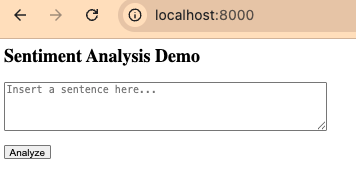
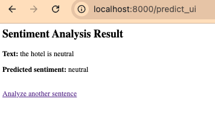
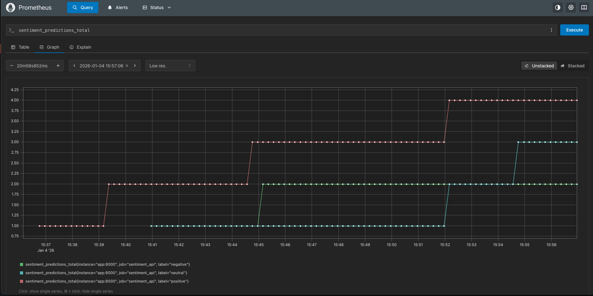
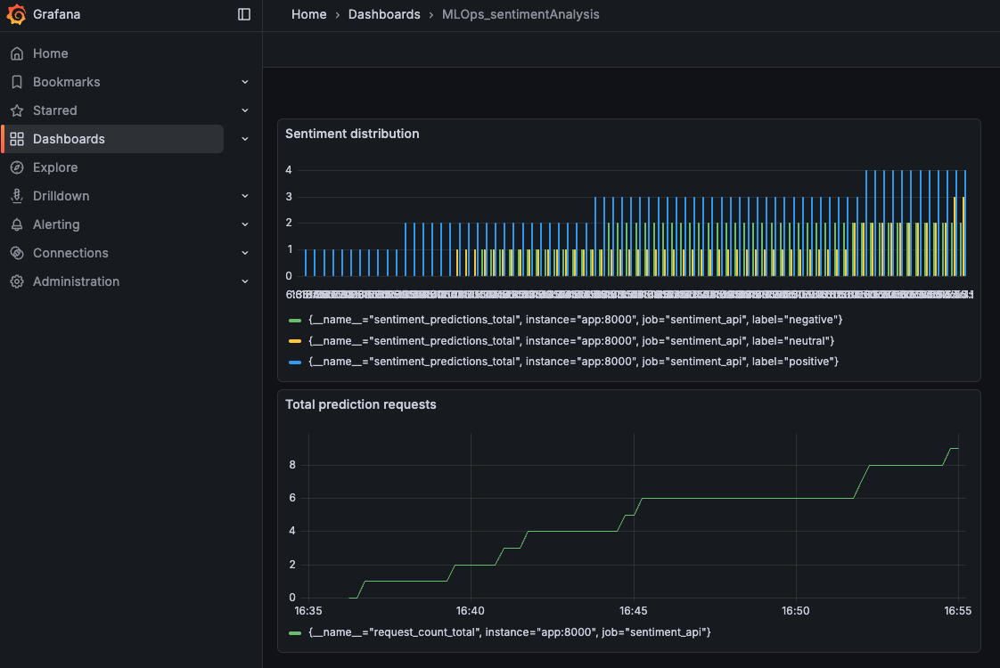

# MachineInnovators

Il progetto implementa un sistema di analisi del sentiment basato su un modello pre-addestrato di Hugging Face, seguendo un approccio MLOps:

- Fase 1: preparazione dati e utilizzo del modello di sentiment

- Fase 2: pipeline automatizzata (preprocessing, validazione, test)

- Fase 3: monitoraggio (Docker, Prometheus)

## Struttura del progetto

```
.
├── data
│ ├── processed
│ │   └── sentiment_dataset.csv
│ └── raw
│     └── hotel_reviews.csv
├── docker-compose.yml
├── Dockerfile
├── prometheus.yml
├── pytest.ini
├── requirements.txt
├── sentiment_model.py
├── src
│ ├── model
│ │   └── sentiment_model.py
│ ├── preprocessing
│ │   └── preprocess.py
│ ├── service
│ │   └── main.py
│ └── training
│     └── train.py
└── tests
    └── test_api.py

```

## Svolgimento

### 1️⃣ Descrizione Fase 1

Questa fase ha lo scopo di preparare i dati e utilizzare un modello di sentiment pre-addestrato per classificare testi in sentiment positivo, neutro o negativo.
Qui non viene addestrato un nuovo modello, ma si costruisce una pipeline riproducibile che permette di usare in modo consistente un modello esistente su un dataset reale.

#### Dataset e preprocessing

Il file `data/raw/hotel_reviews.csv` contiene recensioni di hotel raccolte da fonti pubbliche (https://www.kaggle.com/datasets/datafiniti/hotel-reviews).
Il dataset contiene moltissime informazioni, ma per l’analisi del sentiment ne vengono utilizzate solo due:

- il testo della recensione (reviews.text)
- il rating numerico (reviews.rating)

Lo script `src/preprocessing/preprocess.py` serve a trasformare il dataset grezzo in un dataset utilizzabile dal modello.
Durante il preprocessing vengono selezionate solo le colonne rilevanti, rimosse le righe incomplete e convertito il rating numerico in una label di sentiment (negative, neutral, positive) confrontando il rating numerico del dataset di partenza.

Il risultato di questo step è il file `data/processed/sentiment_dataset.csv`, che rappresenta il dataset di riferimento per tutte le fasi successive del progetto.

#### Modello di sentiment

Il file `src/model/sentiment_model.py` incapsula tutta la logica legata al modello di sentiment.
Qui viene caricato il modello pre-addestrato e viene fornita una funzione per ottenere le predizioni di sentiment a partire da una lista di testi.

### 2️⃣ Descrizione Fase 2

In questa fase il progetto definisce:

- uno script di training automatizzato (inteso come pipeline di preprocessing + validazione)
- un servizio FastAPI per rendere il modello accessibile
- test di integrazione per verificare il corretto funzionamento
- l’integrazione con una pipeline CI/CD

#### Training pipeline (in senso MLOps)

Il file `src/training/train.py` implementa la pipeline di training in senso MLOps, occupandosi di eseguire automaticamente il preprocessing dei dati, caricare il modello di sentiment pre-addestrato e verificarne il comportamento su un campione di dati reali. Le predizioni del modello vengono confrontate con le etichette del dataset per calcolare una semplice metrica di accordo, che viene salvata come artifact versionabile. Questo processo consente di monitorare nel tempo la coerenza del modello senza modificarne i pesi.

#### Servizio FastAPI

Il file `src/service/main.py` espone il modello tramite un servizio web FastAPI, rendendolo utilizzabile sia da sistemi automatici sia da utenti umani.

Il servizio fornisce:

- un endpoint JSON (/predict) per l’inferenza automatica

- un endpoint HTML (/ e /predict_ui) per test manuali tramite browser




- un endpoint (/health) per CI/CD e deploy

#### Test di integrazione

Il file `tests/test_api.py` contiene test di integrazione che verificano il comportamento del servizio FastAPI nel suo complesso. I test vengono eseguiti dalla CI/CD ogni volta che viene fatto un push nel main branch del progetto.

### 3️⃣ Descrizione Fase 3

Questa fase ha lo scopo di implementare un sistema di monitoraggio continuo per il servizio di sentiment analysis, in linea con i principi MLOps di osservabilità e controllo in produzione.

L’obiettivo non è modificare o riaddestrare il modello, ma monitorarne il comportamento nel tempo, sia dal punto di vista delle performance del servizio sia dal punto di vista delle predizioni di sentiment prodotte.

Il sistema di monitoraggio è basato su Docker, Prometheus e Grafana.

#### Architettura di monitoraggio

L’architettura è composta da tre servizi containerizzati:

- Sentiment Analysis API (FastAPI)
  Espone il modello e le metriche di monitoraggio.

- Prometheus
  Si occupa della raccolta e della memorizzazione delle metriche come serie temporali.

  

- Grafana
  Visualizza le metriche raccolte tramite dashboard interattive.

  

Tutti i servizi vengono orchestrati tramite Docker Compose.

#### Strumentazione del servizio

Il file `src/service/main.py` è stato esteso per includere la strumentazione Prometheus tramite la libreria prometheus-client.

All’interno del servizio vengono definite e aggiornate delle metriche che monitorano le predizioni del modello.

Le metriche vengono aggiornate automaticamente ogni volta che viene effettuata una predizione, sia tramite l’endpoint JSON (/predict) sia tramite l’interfaccia HTML (/predict_ui).

Il file prometheus.yml definisce la configurazione di scraping di Prometheus. Prometheus agisce come database di monitoraggio, mantenendo lo storico delle metriche nel tempo.

Grafana viene utilizzato come strumento di visualizzazione e analisi delle metriche raccolte da Prometheus. Qui Prometheus viene usato come data source, usando delle dashboard per monitorare le metriche.

## 🚀 Come usare il progetto

Requisiti:

- Docker
- Docker Compose

### Avvio

Dalla root del progetto:

```
docker compose up --build
```

Questo comando avvia:

- il servizio FastAPI di sentiment analysis

- Prometheus per il monitoraggio

- Grafana per la visualizzazione

Servizi disponibili

- Sentiment API → http://localhost:8000

- Prometheus → http://localhost:9091

- Grafana → http://localhost:3000

### Analisi del sentiment

Via API:

```
curl -X POST http://localhost:8000/predict \
  -H "Content-Type: application/json" \
  -d '{"texts":["Amazing stay!", "Terrible service."]}'
```

Via browser:

- Apri http://localhost:8000

- Inserisci una frase

- Visualizza il sentiment

### Monitoraggio

Le metriche vengono raccolte automaticamente a ogni predizione.

Prometheus raccoglie le metriche del serivizio, Grafana mostra il numero di richieste e la distribuzione del sentiment

#### Arresto

```
docker compose stop   # ferma i servizi
docker compose down   # rimuove i container (dati persistenti)
```
